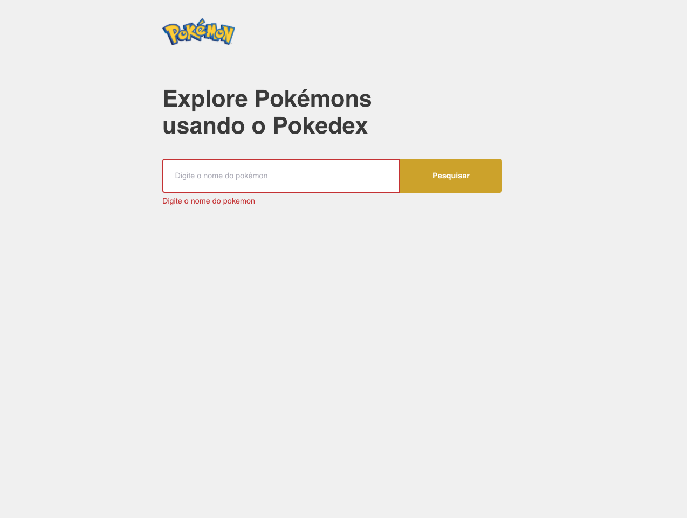
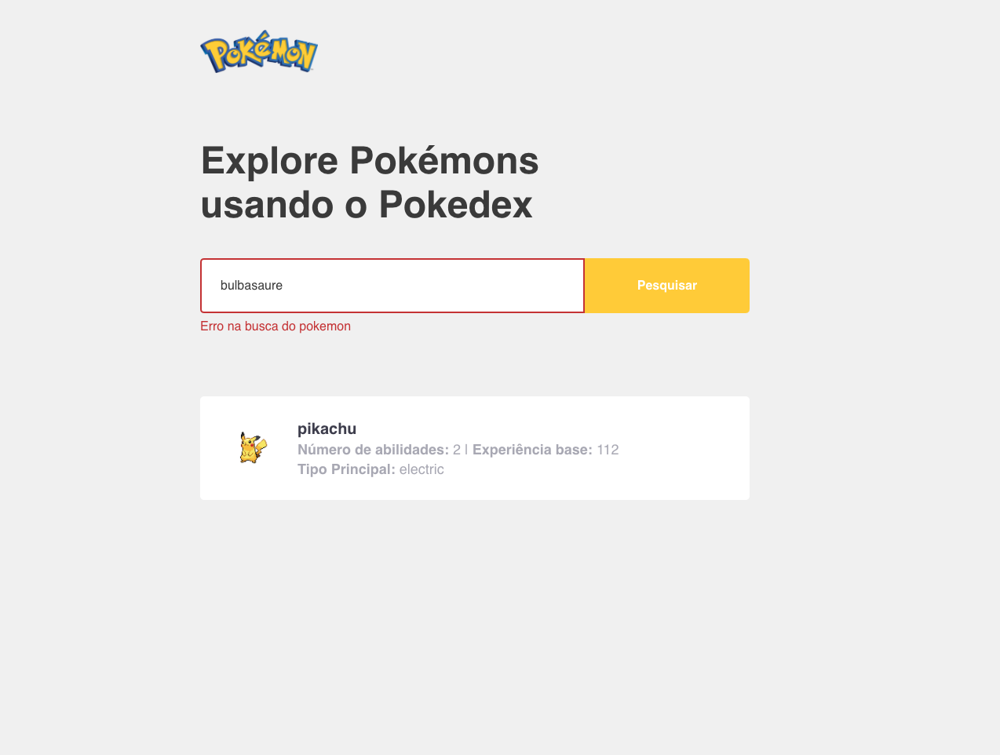
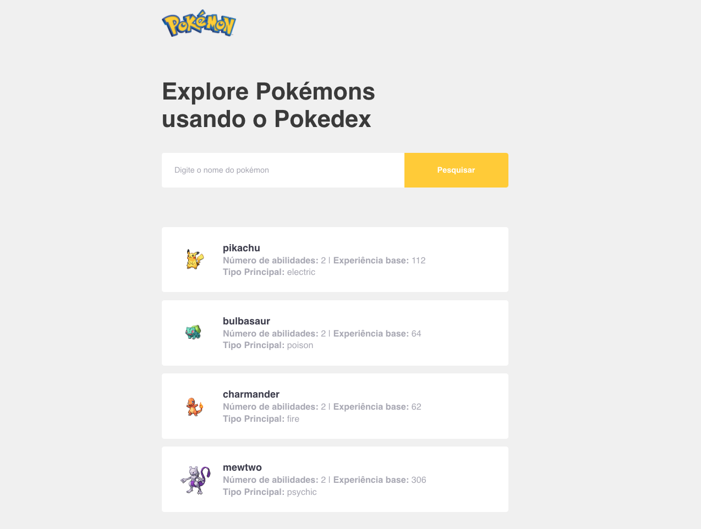
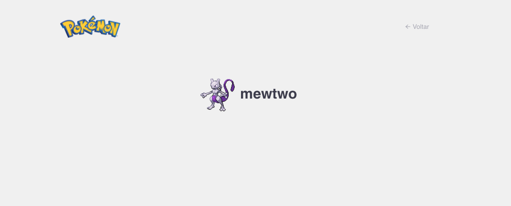

<h3 align="center">
  ReactJS - Pokémon Explorer
</h3>

<blockquote align="center">“TO ACHIEVE WHAT OTHERS WONT, YOU HAVE TO DO WHAT OTHERS DON'T!”</blockquote>

  <a href="#rocket-about-the-project">About the project</a>&nbsp;&nbsp;&nbsp;|&nbsp;&nbsp;&nbsp;
  <a href="#camera-demo-gif">DEMO</a>&nbsp;&nbsp;&nbsp;|&nbsp;&nbsp;&nbsp;
  <a href="#rocket-run-the-project">Run the project</a>

## :rocket: About the project

Application to seach for pokémons and some information about.

Developed using ReactJS with:

- Typescript
- Styled-Components
- EsLint and Prettier to standardize the code
- Axios

## :camera: DEMO GIF

## :camera: Some Shots

## :rocket: Run the project

To run the project, go to project folder and:  

- yarn
- yarn start
   

To build, for production:  

- yarn
- yarn build
